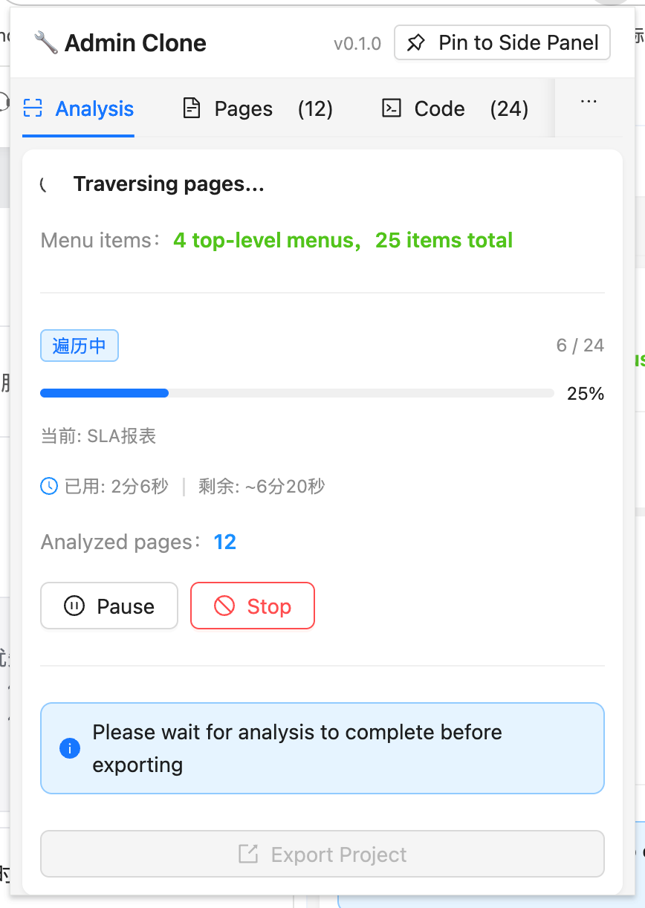
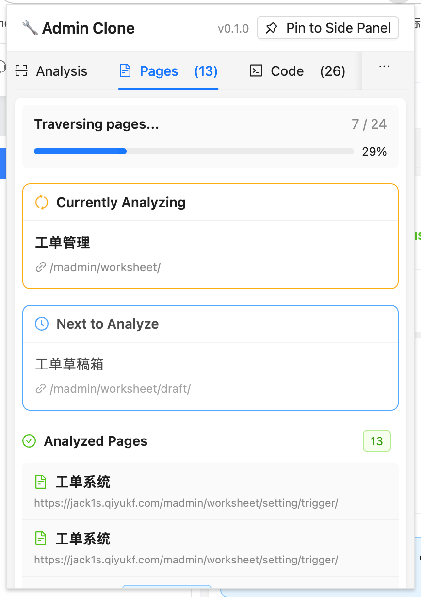
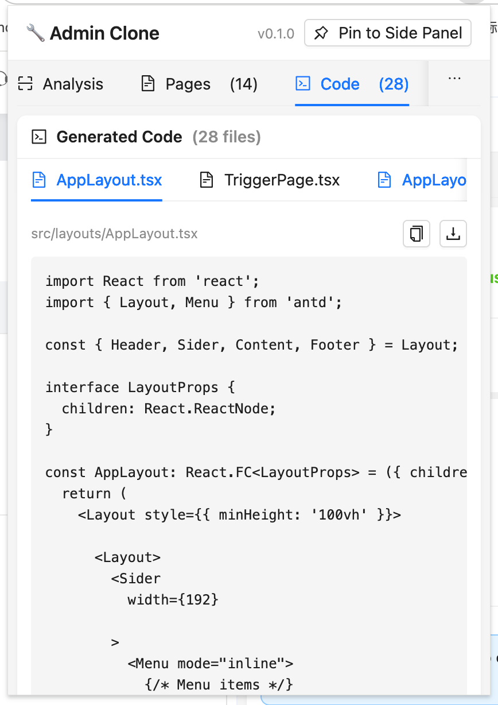
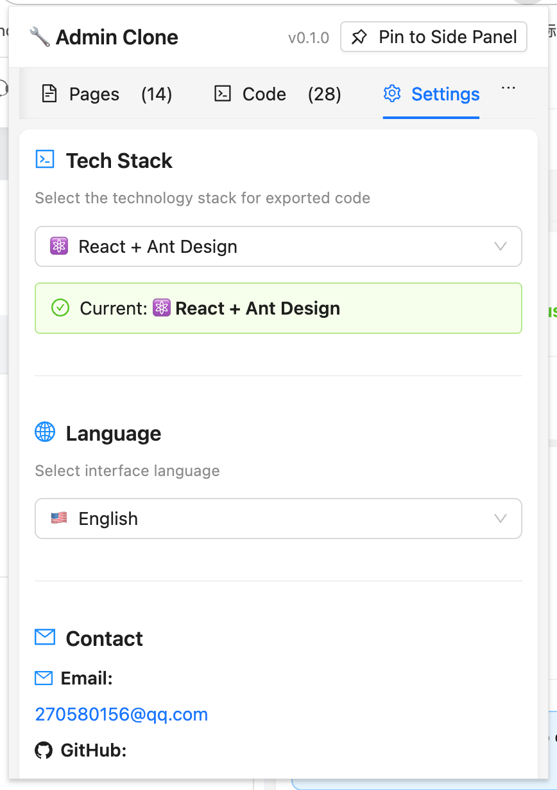

# Admin Clone

Chrome 插件，用于分析后台管理系统的界面结构，自动导出可编辑的 React + Ant Design 代码。

## 功能亮点

- 一键分析当前后台页面
- 遍历菜单并批量采集所有页面
- 自动生成 React + Ant Design 代码（后续会支持更多技术栈）
- 提供 Popup 与浏览器侧边栏双入口
- 自带构建、打包、同步、上传脚本

## 本地安装（Chrome）

1. 下载仓库里最新的 `admin-clone.zip`（由脚本自动产出）。
2. 解压后可得到可直接使用的 `dist/` 目录。
3. 打开 `chrome://extensions`，开启 **开发者模式**，点击 **加载已解压的扩展程序**。
4. 选择解压得到的 `dist/`。
5. （可选）在浏览器工具栏中固定插件，并在右侧面板里打开 “Admin Clone”。

## 界面预览

| 分析面板 | 页面遍历 |
| --- | --- |
|  |  |

| 代码预览 | 设置页 |
| --- | --- |
|  |  |
